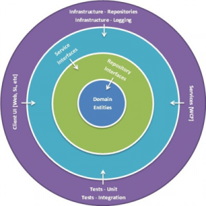

##### Bu dökümanın amacı kullanılan araçları ve bunların yanında kullanabileceğiniz araçlar dahil komple bir eğitim aracı hazırlamak.

# Mimariler (Geleneksel + Onion)
## Geleneksel Mimari
- Bir backend geliştirilirken geleneksel katmanlı mimari kullanırken temelde 3 katman bulunur,

### Presentation Layer (PL)
- Sunum katmanı dış dünyadan gelen istek olarak tanımlanabilir.
---
### Business Layer (BL)
- İşlem yapan algoritmaların olduğu katmanımız, tüm operasyon ve işler burada döner.
---
### Data Access Layer (DAL)
- Veri tabanına bağlanıp istenen değerleri getirecek.
---
 Bunu neden kullanmayacağız? 
- Değişikliğe çok dirençli.
- Katmanlar arası sıkı bağımlılık mevcuttur.
- Büyük ölçekli ve karmaşık uygulamalarda yetersizdir.
- Dal katmanı merkezidir. Böylece uygulama tasarımında verinin geliş tarzına bir bağlılık oluşmaktadır.
- Dal mantığının değişmesi ihtiyacında yüksek maliyet olarak karşımıza çıkmaktadır.
---
## Onion Architecture

- Merkezden Başlar
- İlişki türleri inanılmaz gevşek olan yapılanmadır
---
### Domain - Domain Entities - Core Layer
- Yapılacak Domainle ilgili nesneler bulunur(Entities, Value Object, Exceptions)
- Merkezi Katmandır
---
### Repository & Service Intercafes - Core Layer --> Application Katmanı
- Domain ile iş katmanı arasında soyutlama yapılan katmandır
- Tüm servis arayüzleri(interfaceler) burada tanımlanır(IRepository, IXService)
- Domain katmanını referans eder
- Bu katmanın amacı veri erişiminde gevşek bağlı(loose coupling) bir yaklaşım sergilemektedir
- DTO, ViewModel, Mapping, Validators, CQRS Pattern
---
#### Ara Not:
- Onion architecturede her katman kendinden önceki katmanı referans eder!
---
### Persistence Layer
- Veritabanı operasyonlarını, veri erişim mantığınbı yürüten katmandır
- Application katmanındaki repository interfacelerinin concrete nesneleri burada oluşacaktır.
- DbContext, Migrations, Configurations, Seeding, Repository Concrete Class
---
### Infrastructure Layer 
- Persistance katmanı ile bütünleşebilen bir katmandır diyebiliriz. 
- Nihayetinde her ikiside iş-business katmanıdır.
- Sadece Persistenceden farkı veritabanının dışındaki operasyonları servisleri ve işlemleri  yürüttüğümüz katmandır.
- Veritabanından olan veri erişimi dışındaki tüm servisleri bu katmanda inşa edilir.
- Email SMS Service, Notification, Payment 
---
### Presentation Layer
- Kullanıcının uygulamayla iletişime geçtiği katmandır.
- Web App, Web Api, MVC

