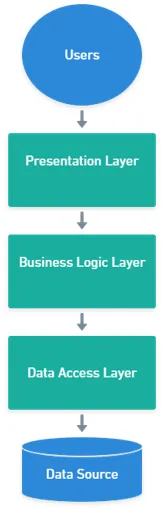

##### Bu dökümanın amacı kullanılan araçları ve bunların yanında kullanabileceğiniz araçlar dahil komple bir eğitim aracı hazırlamak.

# Mimariler (Geleneksel + Onion)
## Geleneksel Mimari
- Bir backend geliştirilirken geleneksel katmanlı mimari kullanırken temelde 3 katman bulunur,

### Presentation Layer (PL)
- Sunum katmanı dış dünyadan gelen istek olarak tanımlanabilir.
### Business Layer (BL)
- İşlem yapan algoritmaların olduğu katmanımız, tüm operasyon ve işler burada döner.
### Data Access Layer (DAL)
- Veri tabanına bağlanıp istenen değerleri getirecek.
---
 Bunu neden kullanmayacağız? 
- Değişikliğe çok dirençli.
- Katmanlar arası sıkı bağımlılık mevcuttur.
- Büyük ölçekli ve karmaşık uygulamalarda yetersizdir.
- Dal katmanı merkezidir. Böylece uygulama tasarımında verinin geliş tarzına bir bağlılık oluşmaktadır.
- Dal mantığının değişmesi ihtiyacında yüksek maliyet olarak karşımıza çıkmaktadır.
---

